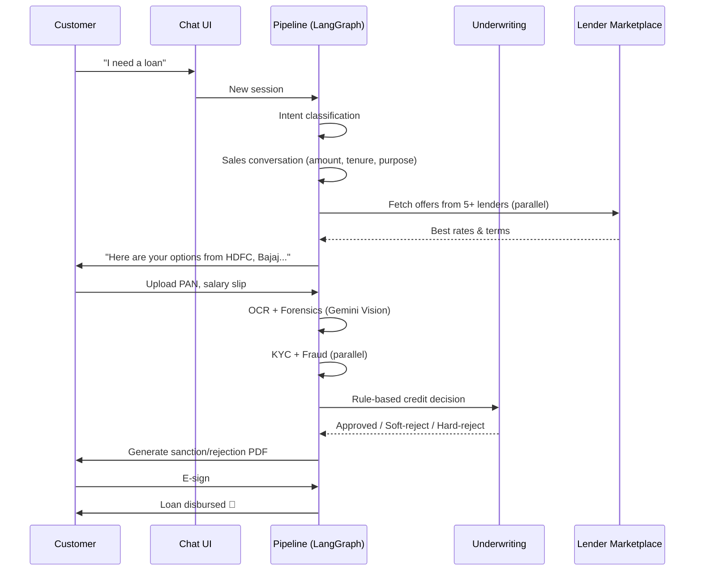
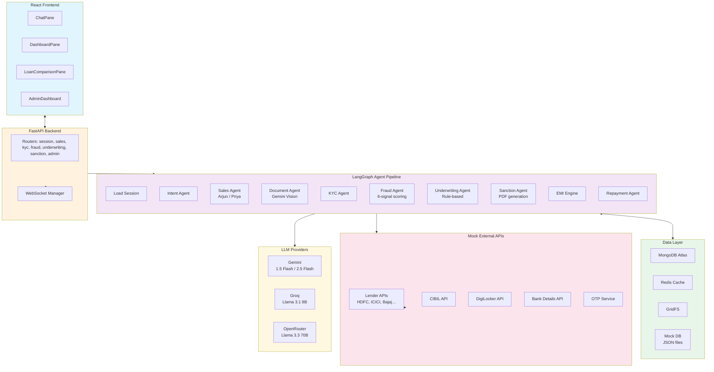
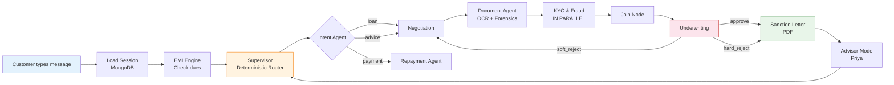
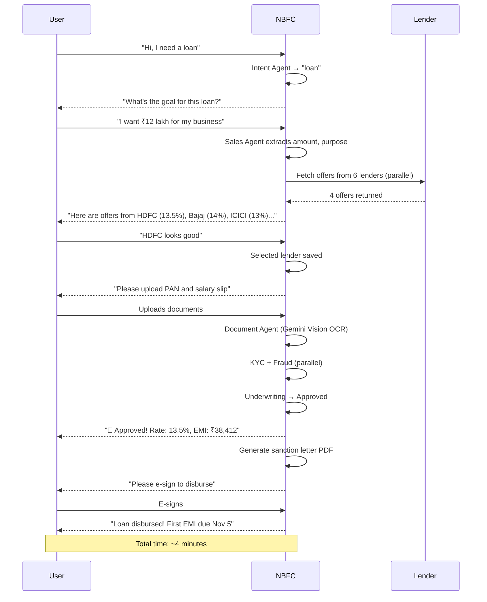
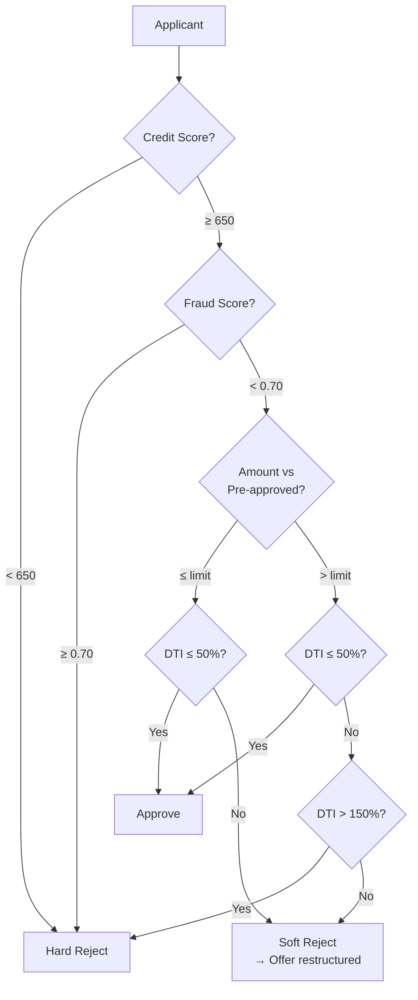

<p align="center">
  
  
  
  
  
  
</p>

<h1 align="center">FinServe NBFC</h1>
<p align="center"><strong>AI-powered loan origination platform with a multi-agent pipeline, real-time decisioning, and a multi-lender marketplace.</strong></p>

<br>

> **NBFC** = Non-Banking Financial Company. This platform handles the full loan lifecycle — from a customer saying *"I need ₹5 lakh"* to funds being disbursed — using a deterministic chain of LLM-powered agents, rule-based underwriting, and document forensics.

---

## The Problem

Applying for a loan at an Indian NBFC is a fragmented, high-friction process:

- **Manual underwriting** takes 3–7 days and requires constant back-and-forth
- **Paper documents** get lost, re-uploaded, or flagged incorrectly
- **No transparency** — applicants wait in the dark after submitting
- **Multiple lenders** means filling the same form 5 times
- **Fraud checks** happen late in the pipeline, wasting processing effort

This project collapses that 7-day process into a **single conversational session** with real-time feedback and automated decisioning.

---

## How It Works (30-Second View)



---

## Features

| Layer | Capability | How |
|-------|-----------|-----|
| **Conversational Sales** | Two AI personas: *Arjun* (loan specialist) and *Priya* (financial advisor) | LangChain + LLM with structured JSON extraction |
| **Intent Detection** | Classifies user intent before routing (loan, advice, KYC, payment) | LLM + regex fallback, zero hallucination for confirmations |
| **Document Forensics** | OCR + tamper detection on PAN, Aadhaar, salary slips, bank statements | Gemini 2.5 Flash Vision |
| **KYC Verification** | Cross-checks document name against CRM, validates document type per loan tier | Rule-based token overlap |
| **Fraud Screening** | 6-signal risk scoring (name mismatch, income inflation, tampering, etc.) | Deterministic, no LLM overhead |
| **Underwriting** | DTI/FOIR, credit score, employer whitelist, LTV checks, force-reject overrides | Pure rules — transparent and auditable |
| **Multi-Lender Marketplace** | Fetches offers from multiple lenders in parallel, presents best option | `ThreadPoolExecutor` + eligibility scoring |
| **Soft-Reject Negotiation** | Offers restructured terms when the original request exceeds limits | Alternative EMI/amount calculation |
| **Sanction Letter PDF** | Generates legally-formatted PDF sanction/rejection letters | ReportLab |
| **EMI Engine** | Tracks payment history, dynamically adjusts credit score (up for on-time, down for overdue) | In-memory + DB persistence |
| **Real-Time UI** | WebSocket-pushed agent thinking indicators, loan status, notifications | FastAPI WebSocket + React |
| **Admin Dashboard** | Portfolio analytics, lender management, performance metrics | React + Recharts |
| **CRM Sync** | Automatically syncs customer data back to Users collection on every session save | Motor upsert |

---

## Architecture



### Data Flow



---

## Repository Structure

```
NBFC/
├── agents/                    # LangGraph agent nodes
│   ├── master_graph.py        # Pipeline graph definition (edges + nodes)
│   ├── master_router.py       # Deterministic rule-based router (NO LLM)
│   ├── master_state.py        # TypedDict schema for full pipeline state
│   ├── session_manager.py     # MongoDB session persistence + CRM sync
│   ├── intent_agent.py        # LLM classifies: loan / advice / kyc / payment
│   ├── sales_agent.py         # Dual persona: Arjun (sales) / Priya (advisor)
│   ├── document_agent.py      # Gemini Vision OCR + forensic extraction
│   ├── document_query_agent.py # Answers "what documents do I need?"
│   ├── kyc_agent.py            # Cross-checks document name vs CRM
│   ├── fraud_agent.py          # 6-signal deterministic fraud scoring
│   ├── underwriting.py         # DTI, credit score, LTV, employer rules
│   ├── sanction_agent.py       # PDF generation via ReportLab
│   ├── emi_engine.py           # Payment simulation + dynamic credit scoring
│   └── repayment_agent.py      # Guides users through EMI payment
│
├── api/                       # FastAPI backend
│   ├── main.py                # App entry, CORS, error handlers, WebSocket
│   ├── config.py              # Pydantic Settings (env-based)
│   ├── routers/               # 12 domain routers
│   │   ├── session.py         # Session CRUD
│   │   ├── sales.py           # Chat endpoint
│   │   ├── documents.py       # Upload endpoint
│   │   ├── kyc.py / fraud.py / underwriting.py
│   │   ├── sanction.py / advisory.py / payment.py
│   │   └── admin.py           # Portfolio analytics
│   ├── schemas/               # Pydantic request/response models
│   └── core/                  # Shared infra
│       ├── websockets.py      # ConnectionManager per session
│       ├── redis_cache.py     # LLM response cache
│       ├── email_service.py   # SMTP notifications
│       └── validation.py      # Robust JSON parser from LLM output
│
├── frontend/                  # React + Vite + Tailwind
│   ├── src/
│   │   ├── App.tsx            # Main chat + dashboard layout
│   │   ├── components/
│   │   │   ├── ChatPane.tsx        # Conversational UI
│   │   │   ├── DashboardPane.tsx   # Loan status cards
│   │   │   ├── LoanComparisonPane.tsx  # Multi-lender offers
│   │   │   ├── AdminAnalytics.tsx  # Portfolio KPIs
│   │   │   └── ... (19 components)
│   │   ├── api/
│   │   │   ├── client.ts          # REST API client
│   │   │   └── websocket.ts       # WebSocket client
│   │   └── types.ts
│   └── package.json
│
├── db/                        # Database layer
│   ├── database.py            # Motor client + collection init + auto-fallback
│   ├── mock_database.py       # JSON file-based mock for dev
│   ├── gridfs_service.py      # Document file storage
│   └── schemas.py             # LoanComparison, LenderOffer, etc.
│
├── mock_apis/                 # Simulated external services
│   ├── lenders.json           # 7+ lender definitions with rates, limits
│   ├── customers.json         # Pre-seeded customer profiles
│   ├── lender_apis.py         # Parallel offer fetch + FOIR eligibility
│   ├── loan_products.py       # Personal, Student, Business, Home loans
│   ├── cibil_api.py           # Credit score simulation
│   ├── digilocker_api.py      # Document verification mock
│   ├── bank_details_api.py    # Account validation
│   └── otp_service.py         # Twilio simulation
│
├── utils/                     # Shared helpers
│   ├── financial_rules.py     # EMI calc, FOIR, pricing rate, fraud score
│   ├── eligibility_checker.py # Product-level eligibility
│   ├── loan_ranker.py         # Multi-lender ranking engine
│   └── pdf_generator.py       # Alternative PDF generation
│
├── tests/
├── config.py                  # LLM fallback chain (Groq → Gemini → OpenRouter)
├── requirements.txt
└── .env.example
```

---

## Tech Stack

| Layer | Technology | Rationale |
|-------|-----------|-----------|
| **Agent Framework** | [LangGraph](https://github.com/langchain-ai/langgraph) | State graph with deterministic routing; no LLM wasted on routing decisions |
| **LLM Providers** | Groq (Llama 3.1 8B) → Gemini (1.5 Flash) → OpenRouter (Llama 3.3 70B) | Automatic fallback chain; starts with cheapest/fastest |
| **Vision** | Gemini 2.5 Flash | Multimodal OCR + tamper detection |
| **Backend** | FastAPI + Uvicorn | Async, auto-docs, WebSocket-native |
| **Frontend** | React 19 + Vite + Tailwind | Fast dev loop, modern CSS utilities |
| **Database** | MongoDB Atlas (Motor) + mock JSON fallback | Document model fits loan data; Motor for async |
| **Cache** | Redis / Memurai | LLM response caching, session TTL |
| **PDF** | ReportLab | Server-side sanction/rejection letters |
| **Real-time** | WebSocket | Agent "thinking" indicators, notifications |

### Why a Deterministic Router Instead of an LLM Supervisor?

The `master_router.py` uses pure rule-based logic (no LLM call) to decide which agent runs next. This was a deliberate design choice:

- **Predictability**: The pipeline is fully deterministic. You can trace exactly why the system moved from KYC to Underwriting.
- **Cost**: Every LLM call costs money and adds latency. The router costs $0.
- **Debuggability**: When a test fails, the route decision is in the action log with a human-readable reasoning string.
- **Parallel execution**: KYC and Fraud agents execute simultaneously because the router knows they're independent.

```python
# Example routing logic (simplified)
if intent == "loan" and not loan_confirmed:
    return "sales_agent", "Gathering loan requirements"
if intent == "loan" and documents_uploaded and kyc == "pending":
    return "verification_agent", "Proceeding to KYC"
```

---

## Getting Started

### Prerequisites

- Python 3.10+
- Node.js 18+
- MongoDB Atlas account (or local MongoDB)
- At least one LLM API key (Groq is fastest and free)

### Installation

```bash
# 1. Clone
git clone https://github.com/SarangRao20/NBFC.git
cd NBFC

# 2. Backend
python -m venv venv && source venv/bin/activate
pip install -r requirements.txt

# 3. Environment
cp .env.example .env
# Edit .env — at minimum add GROQ_API_KEY or GEMINI_API_KEY

# 4. Frontend
cd frontend && npm install && cd ..
```

### Running

```bash
# Terminal 1 — Backend
python main.py
# → http://localhost:8000 (API)
# → http://localhost:8000/docs (Swagger)

# Terminal 2 — Frontend
cd frontend && npm run dev
# → http://localhost:5173
```

**Without any LLM key**: The system falls back gracefully. The sales agent returns static responses, but the full pipeline (intent → documents → KYC → fraud → underwriting → sanction) still works for testing.

**Without MongoDB**: Set `MONGO_URI=mock` in `.env`. Everything runs on local JSON files.

---

## Configuration

Key environment variables:

| Variable | Default | Notes |
|----------|---------|-------|
| `GROQ_API_KEY` | — | Fastest provider; recommended for dev |
| `GEMINI_API_KEY` | — | Required for document Vision OCR |
| `MONGO_URI` | `mock` | Set to MongoDB Atlas URI for persistence |
| `DISABLE_OTP` | `false` | Set to `true` for dev (uses `123456`) |
| `APP_ENV` | `development` | Set to `production` for deployment |
| `MIN_CREDIT_SCORE` | `700` | Underwriting threshold |
| `MAX_DTI_RATIO` | `0.50` | 50% max debt-to-income |

Full list in `.env.example`.

---

## API & WebSocket Reference

### REST Endpoints

| Method | Path | Purpose |
|--------|------|---------|
| `POST` | `/session/start` | Create new loan session |
| `POST` | `/session/{id}/chat` | Send message (triggers pipeline) |
| `POST` | `/upload` | Upload document (PAN, salary slip) |
| `GET` | `/loan/offers` | Fetch multi-lender offers |
| `GET` | `/session/{id}/state` | Get current pipeline state |
| `POST` | `/auth/login` | Customer auth |
| `GET` | `/admin/analytics` | Portfolio metrics |

Full OpenAPI spec at `http://localhost:8000/docs`.

### WebSocket Events

```
ws://localhost:8000/ws/{session_id}

Server → Client:
  { "type": "AGENT_THINKING", "agent": "Arjun", "thinking": true }
  { "type": "NOTIFICATION", "priority": "high", "message": "..." }
  { "type": "AGENT_MESSAGE", "agent": "...", "content": "..." }
```

---

## Example Workflow



---

## Underwriting Rules (Deterministic)

The underwriting engine (`agents/underwriting.py` + `utils/financial_rules.py`) uses clear, documented thresholds:



Additional rules:
- Employer whitelist (Google, Microsoft, TCS, etc.) → automatic low risk
- Secured loans (home/car) → LTV check (< 85%)
- Developer override: set `loan_purpose` to `"force reject"` or `principal=99999` to test rejection flow
- Existing EMI burden is tracked and updated dynamically after disbursement

---

## Multi-Lender Marketplace

When a customer confirms loan terms, the system queries all registered lenders in parallel:

```python
with ThreadPoolExecutor(max_workers=len(lender_ids)) as executor:
    futures = {executor.submit(fetch_lender_offer, ...): lid for lid in lender_ids}
```

Each lender (defined in `mock_apis/lenders.json`) has its own:
- Min/max loan amount & tenure
- Base rate + credit-score-based adjustment
- FOIR limit (max EMI/salary ratio)
- Risk profile and approval probability

The best offer (lowest rate) is pre-selected, but the user sees all options and can pick.

---

## Performance & Limitations

### What It Does Well

- **End-to-end loan application in ~4 minutes** (vs 3–7 days manually)
- **No LLM calls for routing** — deterministic router saves ~$0.02 per turn
- **All underwriting is rule-based** — fully auditable, no black-box decisions
- **Works offline** — mock DB + no LLM fallback for pipeline testing
- **Parallel verification** — KYC and fraud run concurrently

### Known Limitations

- **Mock external APIs only** — CIBIL, DigiLocker, bank verification, and lender offers are simulated with JSON files. Replace with real API clients for production.
- **Document OCR is simplified in `document_agent.py`** — the current active code bypasses Gemini Vision and returns hardcoded verification. The full Vision pipeline exists in the commented-out section.
- **No persistent user auth** — sessions are session-based, not JWT. The auth router exists but password hashing and token validation are minimal.
- **Single-process agents** — the LangGraph pipeline runs in-process. For high throughput, you'd decouple agents into separate workers with a message queue.
- **EMI Engine is in-memory** — dynamic credit score changes are persisted to DB but the simulation logic runs on every graph invocation.
- **PDF templates are basic** — ReportLab generates text-heavy documents without branded formatting.

---

## Roadmap

- [ ] Replace mock APIs with real integrations (CIBIL, DigiLocker, GST, UPI)
- [ ] Add JWT-based auth with OAuth2
- [ ] Implement proper job queue (Celery / Redis Queue) for agent workers
- [ ] Add LLM-as-Judge evaluation harness for sales agent responses
- [ ] Support WhatsApp/Telegram channel via Twilio
- [ ] Add A/B testing framework for underwriting rules
- [ ] Build automated repayment pipeline (ACH/NEFT mandate)
- [ ] Add co-lending / syndication support
- [ ] Real-time credit score simulation dashboard for customers

---

## Contributing

Contributions are welcome. The codebase is structured so each agent is independently testable.

### Quick Start for Contributors

```bash
# Run tests
pytest -q

# With coverage
pytest --cov=agents --cov=api --cov-report=html

# Test a specific agent
pytest tests/test_underwriting.py -v

# Lint
ruff check .
```

### Adding a New Agent

1. Create a node function in `agents/your_agent.py`
2. Add routing logic in `agents/master_router.py`
3. Register the node in `agents/master_graph.py`
4. Add the rule to `supervisor_router()` mapping
5. Create an API endpoint in `api/routers/` if it needs external input

### Design Tenets

- **No LLM in routing decisions** — the supervisor router is pure Python. This is not negotiable.
- **Every agent writes to `action_log`** — the full decision trail is visible in the UI.
- **Sessions are resume-able** — any point in the pipeline can be interrupted and restored from MongoDB.
- **Mock before real** — all external integrations have a mock counterpart for offline development.

---

## License

MIT. See `LICENSE` for details.
