# Registration Agent Workflow

This flowchart represents the exact logic currently implemented in the [registration_agent.py](file:///c:/Users/Lenovo/Desktop/NBFCs/agents/registration_agent.py) and visualized in the [streamlit_app.py](file:///c:/Users/Lenovo/Desktop/NBFCs/streamlit_app.py).

```mermaid
flowchart TD
    Start([Start Registration Agent]) --> Step0
    
    %% Step 0
    Step0[Step 0: Select Loan Type] --> Step1
    
    %% Step 1
    Step1[Step 1: Personal Info]
    Step1 --> V1{Validate Name & Phone}
    V1 -- Invalid --> Step1
    V1 -- Valid --> Step2
    
    %% Step 2
    Step2[Step 2: OTP Verification]
    Step2 --> SendOTP[Call Send OTP Mock API]
    SendOTP --> EnterOTP[User Enters OTP]
    EnterOTP --> V2{Verify OTP}
    V2 -- Fails 3 Times --> HandleOTPFail[Registration Fails]
    V2 -- Success --> Step3
    
    %% Step 3
    Step3[Step 3: Employment Info]
    Step3 --> SelectEmp[Select Salaried/Self-Employed]
    SelectEmp --> EnterIncome[Enter Income > 0]
    EnterIncome --> Step4
    %% Step 4
    Step4[Step 4: DigiLocker KYC]
    Step4 --> EnterAadhaar[Enter 12-digit Aadhaar]
    EnterAadhaar --> InitDL[Call DigiLocker Session API]
    InitDL -- Valid --> TypeDLOTP[Enter UIDAI OTP]
    InitDL -- Invalid --> EnterAadhaar
    TypeDLOTP --> VerifyDL[Call DigiLocker Verify API]
    VerifyDL -- Fails 3 Times --> HandleDLFail[Registration Fails]
    VerifyDL -- Success --> AutoPAN[Auto Extract PAN & Details]
    AutoPAN --> Step5
    
    %% Step 5
    Step5[Step 5: Bank Details]
    Step5 --> EnterBank[Enter Bank Name]
    EnterBank --> FetchBank[Call Bank Mock API]
    FetchBank -- Not Found --> Step5
    FetchBank -- Found (Returns Acc & IFSC) --> Step6
    
    %% Step 6
    Step6[Step 6: Security PIN]
    Step6 --> ChoosePIN{Set New or\nUse Bank PIN?}
    ChoosePIN -- Set New --> TypePIN[Enter & Confirm 4-digits]
    ChoosePIN -- Use Bank --> EnterBankPIN[Enter Bank PIN]
    TypePIN --> Hash(Hash PIN via SHA-256)
    EnterBankPIN --> Hash(Hash PIN via SHA-256)
    
    %% Final
    Hash --> Final[Compile Profile Dict]
    Final --> End([Return Final State / UI Summary])

    %% Styling
    classDef step fill:#2c3e50,stroke:#34495e,stroke-width:2px,color:#ecf0f1;
    classDef decision fill:#d35400,stroke:#e67e22,stroke-width:2px,color:#fff;
    classDef api fill:#27ae60,stroke:#2ecc71,stroke-width:2px,color:#fff;

    class Step0,Step1,Step2,Step3,Step4,Step5,Step6 step;
    class V1,V2,ChoosePIN decision;
    class SendOTP,InitDL,VerifyDL,FetchBank api;
```

